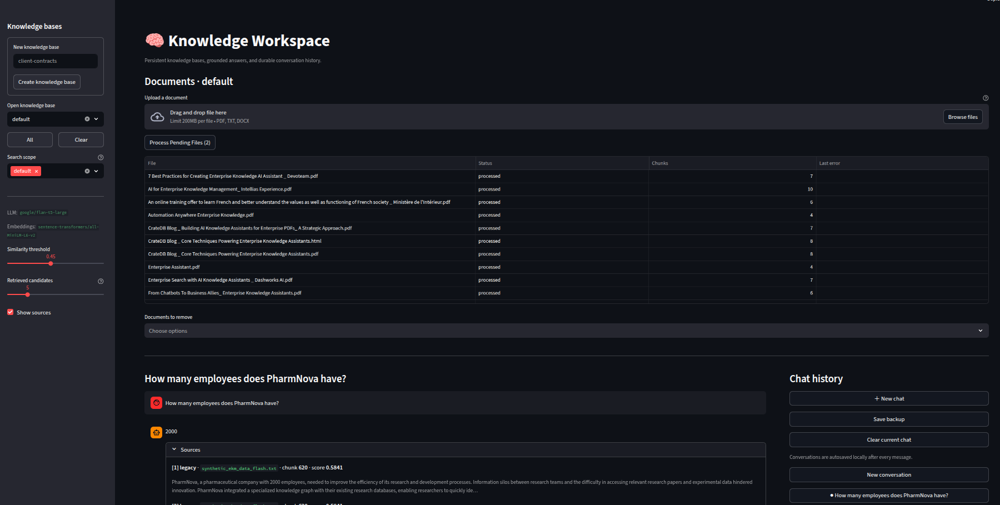

# Enterprise Knowledge Assistant — MVP

A local **Retrieval-Augmented Generation (RAG)** assistant for enterprise documents.
Ask questions in natural language; get answers grounded in your own knowledge base
with source citations. When evidence is insufficient the system explicitly says so
instead of guessing.


> **Status:** MVP / demo. Not production-ready. See [Current Limitations](#current-limitations).

---

## How It Works

```
Create collection → upload original document
    │                         │
    ▼                         ▼
data/raw/<collection>/    Pending (no automatic processing)
    │
    ▼  Process Pending Files
data/cleaned_data/collection_chunks/<collection>/<sha256>.jsonl
    │
    ▼  Qdrant rag_collection_<collection>
    │
    ▼  streamlit run scripts/streamlit_ui.py
User question
    │
    ▼  all-MiniLM-L6-v2 embeds the query
Specific collection or All Collections similarity search → cosine scores
    │
    ▼  Similarity threshold gate (default 0.45)
    ├─ Below threshold → "No evidence found" (LLM is NOT called)
    └─ Above threshold → top-3 chunks fed to flan-t5-large
                              │
                              ▼
                    One grounded answer + collection-aware citations
```

**Why no PostgreSQL, Redis, or Kafka?**
This MVP uses only a local Qdrant instance (file-backed, no Docker required) and
flat JSONL files. A relational database adds no value until multi-user isolation,
document versioning, or production APIs are implemented.

---

## Prerequisites

| Requirement | Version | Notes |
|---|---|---|
| Python | 3.11 | Tested with `conda` env `eka` |
| Qdrant server | ≥ 1.13 | See [Qdrant setup](#qdrant-setup) below |
| CUDA GPU | optional | flan-t5-large runs on CPU but is ~10× slower |
| Tesseract | optional | Only needed for `.png`/`.jpg` image OCR |

### Tesseract (optional — only for image files)

```bash
# Ubuntu / Debian
sudo apt-get install tesseract-ocr

# macOS (Homebrew)
brew install tesseract

# Windows — download installer from:
# https://github.com/UB-Mannheim/tesseract/wiki
```

Without Tesseract, preprocessing will skip image files and print:
`Error processing image ...: tesseract is not installed or it's not in your PATH.`
The rest of the pipeline is unaffected.

---

## Installation

```bash
# 1. Clone
git clone <your-repo-url>
cd LLM-RAG-Enterprise-Knowledge-Assistant-1

# 2. Create a Python 3.11 environment
conda create -n eka python=3.11
conda activate eka

# 3. Install dependencies
pip install -r requirements.txt

# 4. Download NLTK data (done automatically on first preprocessing run)
python -c "import nltk; nltk.download('punkt')"
```

Hugging Face models (`all-MiniLM-L6-v2`, `google/flan-t5-large`) are downloaded
automatically on first use and cached in `~/.cache/huggingface/`.

---

## Qdrant Setup

Qdrant must be running before indexing or querying.

### Option A — Docker (recommended)

```bash
docker run --name qdrant \
  -v $(pwd)/data/vector_index:/qdrant/storage \
  -p 6333:6333 \
  qdrant/qdrant:v1.19.1
```

The vector index is persisted in `data/vector_index/` (gitignored).

### Option B — Pre-built binary

Download from https://github.com/qdrant/qdrant/releases and run:

```bash
./qdrant  # serves on http://localhost:6333 by default
```

**Version note:** This project uses `qdrant-client==1.15.1` with a server running
`1.19.1`. All APIs used (upsert, query, get_collection) are stable across this
range. The client is configured with `check_compatibility=False` to suppress the
version mismatch warning.

Verify Qdrant is running:

```bash
curl http://localhost:6333/healthz
# Expected: healthz check passed
```

---

## Configuration

Edit `config/project_settings.yaml` to change models or Qdrant URL:

```yaml
qdrant:
  url: "http://localhost:6333"
  collection: "enterprise_chunks"       # retained for legacy CLI tools
  collection_prefix: "rag_collection_"

models:
  embedding_model_name: "sentence-transformers/all-MiniLM-L6-v2"
  llm_model_name: "google/flan-t5-large"

pipeline:
  max_answer_length: 512
  temperature: 0.0
  relevance_threshold: 0.45
```

---

## Collection workflow

### 1. Create and upload

Start Streamlit, create a lowercase collection slug, then upload PDF, TXT, or
DOCX files. Upload stores original bytes directly beneath the collection and
marks them **Pending**; it does not process or index them automatically.

```
data/raw/
└── product-docs/
    ├── handbook.pdf
    └── release-notes.docx
```

Collection names use lowercase letters, numbers, hyphens, and underscores. A
same-name or same-content upload is rejected rather than overwriting a source.

### 2. Process Pending Files

Select the collection and click **Process Pending Files**. The operation reuses
the existing extraction and chunking logic, writes one ignored JSONL artifact
per source document, embeds only Pending documents, and creates or updates
`rag_collection_<collection>`. A successful click makes documents searchable
immediately.

The ignored `data/cleaned_data/collection_state.json` manifest records SHA-256
document identity, Pending/Processed status, chunk count, prior indexed hash,
and the most recent error. Changed bytes become Pending again; unchanged
Processed documents are not re-extracted or re-embedded.

Use **Search scope** to select one or more knowledge bases. **All** selects
every processed knowledge base; the app embeds the question once, merges and
ranks the candidates, then produces one grounded answer. The sidebar also
keeps persistent conversations: start a new conversation without losing an
older one, reopen a saved conversation, or save a snapshot on demand.

Documents can be removed from the workspace. Removal deletes the matching
Qdrant points and writes a recoverable local backup under the ignored runtime
state directory.

### Public-repository data policy

`data/raw/`, processed artifacts, Qdrant storage, chat histories, backups, and
Streamlit secrets are local-only and ignored. Do not force-add customer files,
contracts, credentials, or chat exports. The currently tracked `default`
documents are a curated demo corpus; review their redistribution rights before
making the repository public. A clean checkout starts with no runtime state:
add your own documents through the UI after launch.

---

## Legacy batch utilities

```bash
python scripts/embed_and_index.py
```

- These commands retain the former single-JSONL/`enterprise_chunks` workflow
  for diagnostics and do not power new Streamlit collection uploads.
- They embed each chunk with `all-MiniLM-L6-v2` (384-dimensional COSINE vectors).
- Point IDs are deterministic: `uuid5(NAMESPACE_URL, sha256(file_bytes) + "#" + chunk_id)`.
  Re-running the indexer on an unchanged corpus is safe and idempotent — Qdrant
  upsert updates existing points rather than creating duplicates.
- To rebuild from scratch: delete the Qdrant collection and re-run.

---

## Running the Demo

```bash
streamlit run scripts/streamlit_ui.py
```

Opens at http://localhost:8501

**Similarity threshold slider** (sidebar, default **0.45**)

The threshold controls which retrieved chunks qualify as evidence before the LLM
is called. Calibrated empirically on the current corpus:

| Query type | Score range |
|---|---|
| Known-answerable (in corpus) | 0.55 – 0.77 |
| Off-topic (not in corpus)    | 0.16 – 0.38 |

The default 0.45 sits in the clear separation band between these ranges (~0.17 wide).

- **If no chunk scores ≥ threshold** → LLM is NOT called; the UI shows:
  *"No sufficiently relevant information was found in the knowledge base for your question."*
- **If chunks score ≥ threshold** → top-3 chunks are sent to flan-t5-large;
  the grounded answer and source citations are shown.

Raise the threshold to reduce false positives. Lower it if on-topic questions
return "no evidence found".

---

## CLI Developer Tool

```bash
cd scripts
python compare_llm_vs_rag.py
```

Interactive loop comparing a direct LLM answer (no retrieval) with the RAG answer.
Useful for evaluating retrieval quality and prompt behaviour.

---

## Troubleshooting

### Qdrant unavailable
```
Connection refused — http://localhost:6333
```
Start Qdrant (see [Qdrant Setup](#qdrant-setup)).

### Missing Python dependency
```
ModuleNotFoundError: No module named 'X'
```
```bash
conda activate eka
pip install -r requirements.txt
```

### Hugging Face model download fails
Models are cached in `~/.cache/huggingface/`. First run requires internet access.
Set `HF_HOME` to redirect the cache:
```bash
export HF_HOME=/path/to/cache
```

### Tesseract not found
```
Error processing image ...: tesseract is not installed or it's not in your PATH.
```
Install Tesseract (see [Prerequisites](#prerequisites)) or ignore — image files
are skipped and all other documents are processed normally.

### Similarity threshold too high — no results
Lower the threshold in the Streamlit sidebar or pass a lower value to
`rag_engine.answer_with_rag(score_threshold=0.45)`. The 0.45 default works well
for the current corpus; a corpus with different domain or document density may
need re-calibration.

### Stale / incorrect Qdrant collection
To fully rebuild the vector index:

```bash
# 1. Delete the collection (Python)
python -c "
from qdrant_client import QdrantClient
c = QdrantClient('http://localhost:6333', check_compatibility=False)
c.delete_collection('enterprise_chunks')
print('Deleted.')
"

# 2. Re-index
python scripts/embed_and_index.py
```

---

## Current Limitations

| Area | Limitation |
|---|---|
| **LLM quality** | `flan-t5-large` (~770M params) is a small seq2seq model. Answers are often short and may miss nuance. Replace with a larger model in `config/project_settings.yaml` when resources allow. |
| **Context window** | Each chunk is hard-capped at 150 tokens before being sent to flan-t5-large. The full chunk text is shown in citations. |
| **Embedding model** | `all-MiniLM-L6-v2` is a general English-focused model. French and Turkish text is preserved by preprocessing, but multilingual retrieval quality should be evaluated before production use. |
| **OCR** | Image files require a system Tesseract installation. Without it, 2/21 current corpus files (`llm_blog_image.png`, `task_management_automation.png`) are skipped. |
| **Retrieval** | Dense-only retrieval. No BM25/hybrid search or reranking. |
| **No authentication** | Single-user, no access control. |
| **Collection lifecycle** | Documents can be deleted with a local backup. Collection-level rename/delete is intentionally not exposed yet. |
| **No production database** | Data stored in local flat files and a local Qdrant instance. |
| **No monitoring / observability** | No logging aggregation, metrics, or alerting. |
| **No CI/CD** | No automated tests or deployment pipeline. |

---

## Project Structure

```
LLM-RAG-Enterprise-Knowledge-Assistant-1/
├── config/
│   └── project_settings.yaml        # models, Qdrant URL, pipeline params
├── data/
│   ├── raw/                         # local source documents (gitignored)
│   │   └── default/                  # originals, directly in one knowledge base
│   ├── cleaned_data/                # GENERATED — gitignored
│   │   ├── all_processed_data.jsonl
│   │   └── all_processed_files.log
│   │   ├── collection_state.json
│   │   └── collection_chunks/
│   │   ├── chat_history/
│   │   └── collection_backups/
│   └── vector_index/                # GENERATED — gitignored (Qdrant storage)
├── scripts/
│   ├── utils.py                     # config loader, logger, device detection
│   ├── data_preprocessing.py        # document → JSONL chunks
│   ├── embed_and_index.py           # JSONL → Qdrant embeddings
│   ├── collection_manager.py         # persistent collection lifecycle
│   ├── chat_store.py                 # persistent local conversation store
│   ├── rag_engine.py                # shared RAG pipeline (single source of truth)
│   ├── streamlit_ui.py              # demo UI
│   ├── compare_llm_vs_rag.py        # CLI developer comparison tool
│   ├── alignment.py                 # policy/safety stub
│   ├── create_synhetic_data_gemini.py  # synthetic data generation (optional)
│   ├── save_dataset_to_huggingface.py  # dataset publishing (optional)
│   ├── get_similar_chunks_qdrant.py    # diagnostic similarity search
│   └── mlops_pipeline.py               # MLOps placeholder
├── requirements.txt
├── .gitignore
└── README.md
```

---

## Quick Start (clean checkout)

```bash
# 1. Install
conda create -n eka python=3.11 && conda activate eka
pip install -r requirements.txt

# 2. Start Qdrant
docker run --name qdrant -v $(pwd)/data/vector_index:/qdrant/storage \
  -p 6333:6333 qdrant/qdrant:v1.19.1

# 3. Run demo, create a collection, upload documents, then click Process Pending Files
streamlit run scripts/streamlit_ui.py
```

The UI displays a clear service warning if Qdrant is unavailable. Start Qdrant
first, then process pending documents (or use the repair action) before asking
questions.
